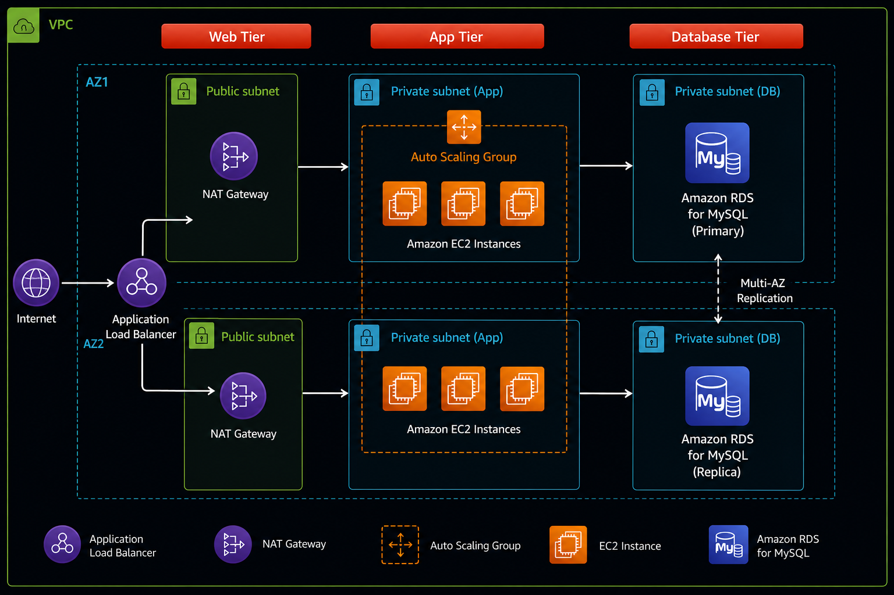

# AWS Three-Tier Web Architecture

## Project Overview

This project demonstrates the design and deployment of a highly available, scalable, and secure three-tier web application on AWS. The infrastructure follows AWS best practices by separating the application into presentation, application, and database tiers within a custom Amazon VPC. This layered architecture improves security, fault tolerance, and scalability while ensuring that only the necessary components are exposed to the internet.

The solution leverages Amazon EC2, Application Load Balancer, Auto Scaling Groups, Amazon RDS MySQL, and Amazon VPC networking components, including public and private subnets, Internet Gateway, and NAT Gateway. Security Groups and IAM are used to enforce least-privilege access, while CloudWatch provides monitoring and health visibility.

---

## Architecture Overview

The architecture consists of three logical layers. Incoming client requests are routed through an internet-facing Application Load Balancer to EC2 instances deployed in private subnets. The application communicates with an Amazon RDS MySQL database located in private subnets, ensuring that only the application servers have access to the database. Auto Scaling Groups and Multi-AZ deployment improve availability and scalability, while NAT Gateways provide secure outbound internet access for private instances.

### AWS Services Used

* **Amazon VPC** – Provides network isolation for the application.
* **Public and Private Subnets** – Separate internet-facing and internal resources.
* **Internet Gateway** – Enables internet access for public resources.
* **NAT Gateway** – Allows private EC2 instances to access the internet without exposing them to inbound traffic.
* **Application Load Balancer (ALB)** – Distributes incoming traffic across healthy EC2 instances.
* **Auto Scaling Group (ASG)** – Automatically scales EC2 instances based on demand and replaces unhealthy instances.
* **Amazon EC2** – Hosts the web application.
* **Amazon RDS MySQL** – Managed relational database for persistent data storage.
* **Security Groups** – Control inbound and outbound network traffic.
* **IAM** – Manages authentication and permissions for AWS resources.
* **Amazon CloudWatch** – Provides monitoring, logging, and health metrics.

---

## Architecture Explanation

### 1. Presentation Tier

* Users access the application through an internet-facing Application Load Balancer.
* The ALB distributes incoming requests across healthy EC2 instances located in private subnets.
* Health checks ensure traffic is only routed to healthy instances.

### 2. Application Tier

* Amazon EC2 instances host the application and business logic.
* Auto Scaling Groups automatically add or remove EC2 instances based on application demand and replace unhealthy instances to maintain availability.
* Private EC2 instances access the internet through a NAT Gateway for software updates and package installation without being publicly accessible.

### 3. Database Tier

* Amazon RDS MySQL stores the application's persistent data.
* The database is deployed in private subnets and is not accessible from the internet.
* Security Groups ensure that only the application tier can communicate with the database.

---

## Security Design

* The Application Load Balancer is the only public entry point into the application.
* EC2 instances are deployed in private subnets without public IP addresses.
* Amazon RDS MySQL is isolated within private subnets and cannot be accessed directly from the internet.
* Security Groups enforce least-privilege network access between the ALB, EC2 instances, and database.
* IAM roles provide secure access to AWS services without embedding credentials in the application.

---

## Future Improvements

* Provision the infrastructure using AWS CDK or Terraform instead of manual deployment.
* Add an internal Application Load Balancer to separate the web and application tiers.
* Implement a CI/CD pipeline using GitHub Actions and AWS.
* Enable HTTPS using AWS Certificate Manager (ACM).
* Configure CloudWatch Alarms and SNS notifications for automated monitoring and alerting.
* Add AWS WAF to protect the application from common web attacks.
